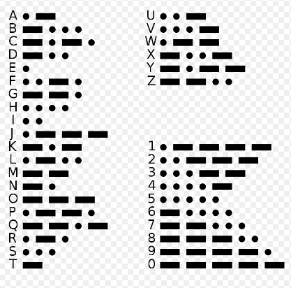

# Decode-Morse Code

## Getting Started
This repository includes a decoder file that decrypts messages to Morse code.

## Authors

## Author 1:

👤 **Jamila Moseka**

- GitHub: [@jmoseka](https://github.com/jmoseka)
- Twitter: [@milamoseka](https://twitter.com/milamoseka)
- LinkedIn: [jamila-moseka](https://linkedin.com/in/jamila-moseka)

## Author 2:
👤 **Brian Nyachae**

- GitHub: [@githubBria222](https://github.com/Bria222)
- Twitter: [@briannyachae9](https://twitter.com/briannyachae9)
- LinkedIn: [Brian-Nyachae](https://linkedin.com/in/brian-nyachae)

## Author 3:
👤 **Hammed Adisa**

- GitHub: [@AbuRayhaan](https://github.com/aburayhaan)
- Twitter: [@ayinla2011](https://twitter.com/Ayinla2011)
- LinkedIn: [Hammed Adisa](https://linkedin.com/in/hammed-adisa)

## 🤝 Contributing

Contributions, issues, and feature requests are welcome!

Feel free to check the [issues page](../../issues/).

## Show your support

Give a ⭐️ if you like this project!

## Acknowledgments

- Hat tip to anyone whose code was used
- Inspiration
- etc

## 📝 License

This project is [MIT](https://github.com/jmoseka/decode-morse-code/blob/decode-morse-code/LICENSE) is licensed.
